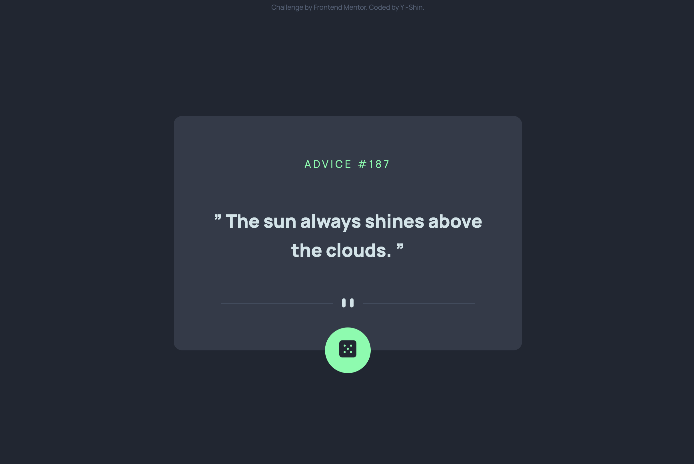

# Frontend Mentor - Advice generator app

This is a solution to the [Advice generator app challenge on Frontend Mentor](https://www.frontendmentor.io/challenges/advice-generator-app-QdUG-13db). Frontend Mentor challenges help you improve your coding skills by building realistic projects.

## Table of contents

- [Overview](#overview)
  - [The challenge](#the-challenge)
  - [Screenshot](#screenshot)
  - [Links](#links)
- [My process](#my-process)
  - [Built with](#built-with)
  - [What I learned](#what-i-learned)
  - [Useful resources](#useful-resources)
- [Author](#author)

## Overview

### The challenge

Users should be able to:

- View the optimal layout for the app depending on their device's screen size
- See hover states for all interactive elements on the page
- Generate a new piece of advice by clicking the dice icon

### Screenshot



### Links

- Solution URL: [Add solution URL here](https://your-solution-url.com)
- Live Site URL: [Live site on Netlify](https://advice-generator-yishin.netlify.app/)

## My process

### Built with

- Desktop-first workflow
- Semantic HTML5 markup
- JavaScript ES6+
- SCSS - CSS preprocessor
- Parcel - build tool for the web

### What I learned

- When the request take too much time, the fulfilled value of promise will become a error message.

  ```js
  const res = await Promise.race([
    fetch("https://api.adviceslip.com/advice"),
    timeout(timeOutSec),
  ]);
  ```

- When user click any child element or itself in button, remaining part will be executed. Or the callback function will be returned right away.

  ```js
  button.addEventListener("click", async function (e) {
    const btn = e.target.closest(".btn");
    if (!btn) return;

    // remaining part
  });
  ```

### Useful resources

- [CSS Loading Animations](https://codepen.io/AlexWarnes/pen/jXYYKL) - This helped me for building up the loading animation in advice-generator app. It is very beautiful, simple, and easy to understand.

## Author

- Website - [Yi-Shin Jheng](https://github.com/Yishin-Jheng)
- Frontend Mentor - [@Yishin-Jheng](https://www.frontendmentor.io/profile/Yishin-Jheng)
